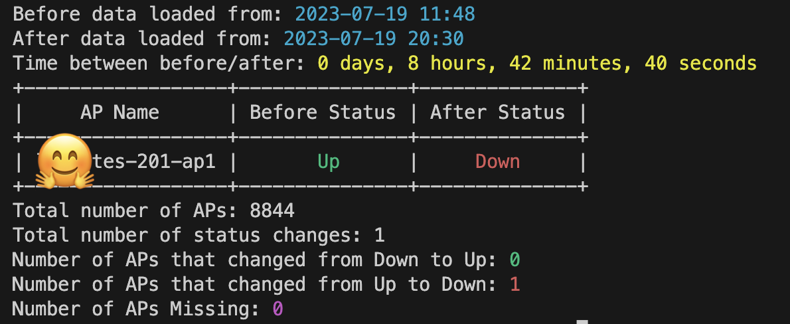

# Aruba AP Status Comparator

Aruba AP Status Comparator is a Python tool that compares the status of Aruba Access Points (APs) before and after maintenance. It fetches AP status data from the controller using the ArubaOS_8 class, stores the data in JSON format, and provides a comparative analysis highlighting any status changes.

## Features

- Fetches and stores AP status data from the Aruba controller in JSON format
- Compares AP status before and after maintenance
- Highlights status changes in a readable format with color coding
- Tracks and displays the time difference between data sets

## Installation

This project uses Python 3.8 and higher. It is recommended to use a virtual environment for running this project. Here's how you can set it up:

1. Clone the repository:
   ```bash
   git clone https://github.com/CyberneticCodeComposer/aruba-ap-comparator.git
   cd aruba-ap-status-comparator
   ```

2. Create a new virtual environment:
   ```bash
   python3 -m venv env
   ```

3. Activate the virtual environment:
   - On macOS and Linux:
     ```bash
     source env/bin/activate
     ```
   - On Windows:
     ```bash
     .\env\Scripts\activate
     ```

4. Install the required packages:
   ```bash
   pip install -r requirements.txt
   ```

## Usage

1. To get and store data before maintenance:
   ```bash
   python ap_comparator.py --before
   ```

2. To get and store data after maintenance:
   ```bash
   python ap_comparator.py --after
   ```

3. To compare the before and after data:
   ```bash
   python ap_comparator.py --compare
   ```
   For example:

  

## Author

This tool was developed by CyberneticCodeComposer, with assistance from OpenAI's ChatGPT.

## License

This project is licensed under the terms of the MIT license.
